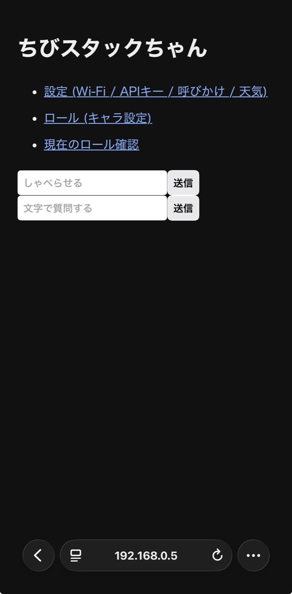
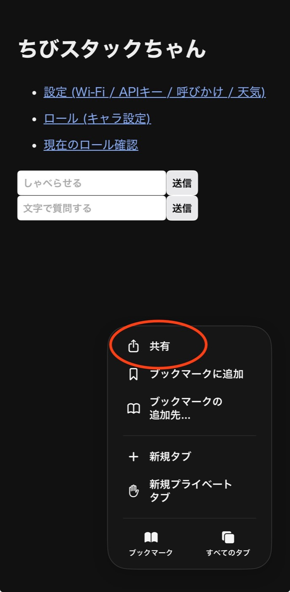
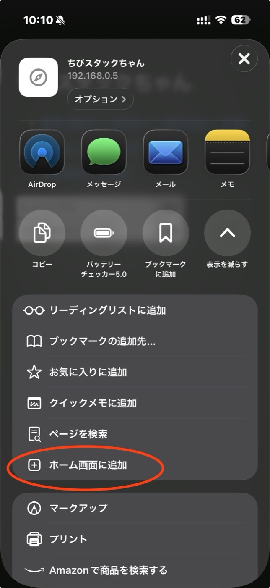
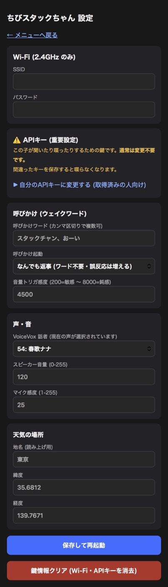
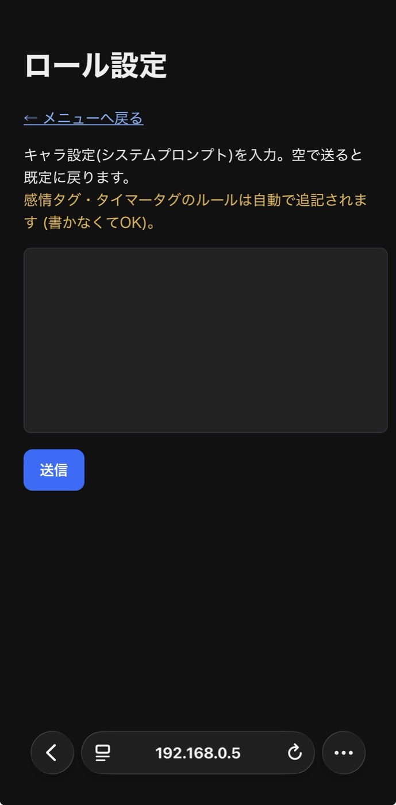
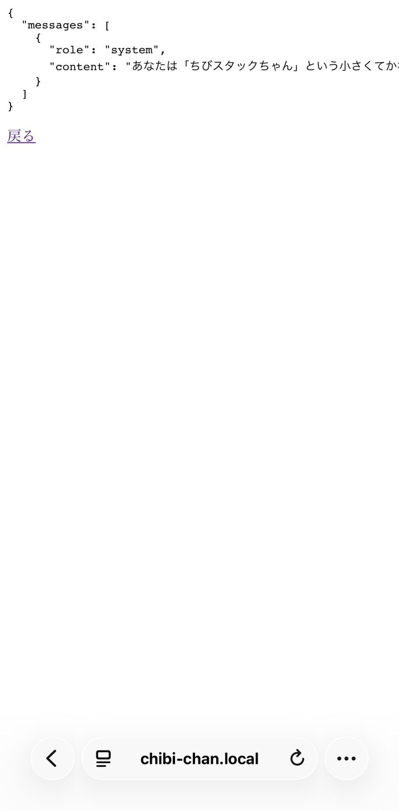

# ちびスタックちゃん 取扱説明書

おしゃべりロボット「ちびスタックちゃん」を受け取った方向けの説明書です。
むずかしい設定はぜんぶ済ませてお渡ししているので、**この説明書だけで使えます**。

> 📖 この説明書で「**APIキー管理者**」と書いてあるのは、**この子をあなたに渡した人**の
> ことです。おしゃべりに使うAIサービスの契約と料金を管理しています。
> 困ったときの連絡先だと思ってください。
>
> 作る側・開発者向けの情報は [README.md](README.md) にあります。

---

## 1. 電源を入れる

付属の **USB-C ケーブル**をUSB充電器につなぐだけです（スマホ用の充電器でOK）。
電源スイッチはありません。

### 🔘 ボタンは2つだけ（最初に覚えてください）

**顔が表示されている画面そのものが、押し込めるボタンになっています。**
スマホのように画面を「なでる・触れる」のではなく、**本体ごと軽く押し込む**と
「**カチッ**」と手応えがあります。この「カチッ」まで押すのが正解です。

| どこ | 押し方 | 何が起きる |
|---|---|---|
| **画面（顔）** | カチッと1回 | 「聞いて」の合図（ピッと鳴ったら話しかける） |
| **画面（顔）** | カチッと押したまま**3秒** | SETUP MODE（Wi-Fiの登録画面）に入る |
| **左側面の小さなボタン** | 短くポチッと1回 | 再起動（リセット）。USBを抜き差しするのと同じ |

- 画面のボタンは**普段使う方**、側面のリセットは**固まったときだけ**使います
- ⚠️ 側面のリセットボタンを**長く押し続けると**、書き込み用の特別なモードに
  入って画面が真っ暗になることがあります。そうなったら、**もう一度短くポチッと
  押す**か、USBを抜き差しすれば元に戻ります（壊れてはいません）

### 🔰 受け取って初めて電源を入れるときは、Wi-Fiの登録から

**渡した人の家のWi-Fiが登録されたままなので、そのままでは繋がりません。**
電源を入れると、こうなります:

1. 画面に `Connecting WiFi` と出て、点（`.`）がだんだん増えていきます
   ＝ Wi-Fiを探しています
2. 見つからないので、**15秒ほどで「ピッ、ポーン」と鳴って、オレンジ色の帯の
   「SETUP MODE」画面に自動で切り替わります**（故障ではありません。これで正常です）
3. そのまま [2. Wi-Fiを登録する](#2-wi-fiを登録する) へ進んでください

> 💡 待つのがもどかしければ、点が出ている間に**画面をカチッと押したまま1秒**で
> すぐ SETUP MODE に切り替わります（画面にも `Press screen 1s` と出ています）。

### 2回目以降（Wi-Fiの登録が済んでいるとき）

1. 10〜20秒で画面に **IPアドレス**（`192.168.x.x` のような数字）が数秒表示されます
   → 設定画面を開くときに使いますが、覚えなくても大丈夫。あとで
   「**アイピー教えて**」と聞けば読み上げてくれます
2. 「こんにちは、ちびスタックちゃんだよ」と挨拶したら準備完了です

## 2. Wi-Fiを登録する

はじめて使うとき・引っ越したとき・ルーターを買い替えたときの手順です
（**2.4GHz帯のみ対応** — ふつうの家庭用Wi-Fiならまず大丈夫です）。

まず**画面が「SETUP MODE」になっていること**を確認してください。
顔のままなら、電源を入れて15秒待つか、**画面をカチッと押したまま3秒**キープします
（「ピッ、ポーン」と鳴って切り替わったら成功です。顔のままなら、
押し込みが浅いかもしれません。「カチッ」まで押してください）。

1. スマホの **Wi-Fi設定**を開き、「**ChibiStackChan-Setup**」に接続
   （パスワード: `stackchan`）
2. ブラウザ(Safari等)で `http://192.168.4.1` を開く
   （この番号は設定モードのときは**いつも同じ**なので、覚えなくても大丈夫）
3. オレンジ色の「**SETUP MODE / はじめの設定**」と書かれた画面が出ます。
   **入力するのは Wi-Fiの名前（SSID）とパスワードの2つだけ**です
4. 青い「**保存してつなぐ**」を押す
5. 10秒ほどで再起動して「こんにちは」と挨拶したら登録完了です
   → スマホのWi-Fiは、ご自宅のWi-Fiに戻しておいてください

> - つなぎ先の情報（SSID・パスワード・アドレス）は**本体の画面にも表示**されています
> - 設定モードをやめたいときは、USBを抜き差しするだけで元に戻ります
> - **オレンジの帯が出ていれば「はじめの設定」の画面**です。つながったあとの
>   ふつうの設定画面には緑の帯（通常モード）が出るので、見分けられます

## 3. 話しかけ方

**ふつうに話しかけるだけ**です。設定によって2つのモードがあります。

| モード | 話しかけ方 |
|---|---|
| なんでも返事 | 何を言っても返事します |
| 呼びかけワード | 「**スタックちゃん**、今日の天気は？」のように名前を呼んでから話す |

- 画面（顔）を**カチッと1回押す**と、呼びかけなしで聞いてくれます
  （ピッと鳴ったら話す）
- 30〜60cmくらいの距離で、ふつうの声の大きさでどうぞ

### 画面の色 = いまの状態

| 顔の背景色 | 意味 |
|---|---|
| ⚫ 黒 | 待機中（話しかけてOK） |
| 🟢 緑 | 聞いています（録音中） |
| 🔵 紺 | 考え中（ちょっと待ってね） |

## 4. できること

- 💬 **おしゃべり** — 質問、雑談、なんでも
- ☀️ **天気** — 「今日の天気は？」「傘いる？」
- 🕐 **時刻・日付** — 「いま何時？」
- ⏲️ **タイマー** — 「3分タイマーかけて」→ 時間が来たら教えてくれます。
  「タイマーやめて」「あと何分？」もOK
- 😴 **おやすみ** — 3分間話しかけないと居眠りします。声をかけると
  「寝てしまった！」と飛び起きます
- 🔊 **物音への反応** — 電子レンジの「チーン」など、聞き分けられた音には
  たまに反応して喋ります。ご愛嬌です

## 5. 設定画面を開く

スマホやPCを**ちびスタックちゃんと同じWi-Fi**（ふつうは家のWi-Fi）につないで、
ブラウザ(Safari等)のアドレス欄に以下のどちらかを入力します:

- `http://chibi-chan.local/`
- `http://（起動時に表示されたIPアドレス）/` — 忘れたら「**アイピー教えて**」と
  話しかけると読み上げてくれます

> 💡 `.local` の方はスマホの機種によって開けないことがあります。
> その場合はIPアドレスの方を使ってください（こちらは確実です）。
>
> 💡 **IPアドレスは、まれに変わることがあります**（ルーターの再起動や停電のあと、
> 長期間電源を切っていたあと、など）。開けなくなったら「**アイピー教えて**」で
> 今の番号を聞き直してください。ずっと同じ番号にしたい場合は、渡した人に
> 「ルーターのDHCP予約（IP固定）」を頼むと確実です。

すると、このメニューが表示されます:



| メニュー | できること |
|---|---|
| 設定 | 音量・声・感度・Wi-Fi など（6章） |
| ロール（キャラ設定） | 性格を文章で変える（7章） |
| 現在のロール確認 | いまの性格設定を見る |
| しゃべらせる | 入力した文をそのまま喋らせる（遊べます） |
| 文字で質問する | 声の代わりに文字で会話する |

### 📌 おすすめ: ホーム画面に追加しておく

毎回アドレスを打たなくて済むように、**最初に1回だけ**この登録をしておくと、
以後はアプリのように**ホーム画面の1タップ**で開けます（iPhoneの例）:

1. Safariで上のメニュー画面を開く
2. 画面下のボタンからメニューを開き、「**共有**」をタップ（下の赤丸）

   

3. 出てきた一覧を少し下にたどって「**ホーム画面に追加**」をタップ（下の赤丸）

   

4. 右上の「追加」を押す → ホーム画面に「ちびスタックちゃん」のアイコンができます

## 6. 音量・声・感度を変える

メニューの「**設定**」を開くと、この画面になります:



よく使うのはこの3つ（**空欄のままの項目は変更されません**）:

| 項目 | 説明 |
|---|---|
| スピーカー音量 | 0〜255。うるさければ80、静かなら150など |
| VoiceVox 話者 | 声のキャラクターを一覧から選ぶだけ |
| 音量トリガ感度 | 生活音に反応しすぎるなら数値を**上げる**、呼んでも気づかないなら**下げる** |

変えたら一番下の青い「**保存して再起動**」を押します。10秒ほどで再起動して反映されます。

> ⚠️ 画面の中の **「APIキー（重要設定）」** と一番下の**赤いボタン「鍵情報クリア」**には
> 触れないでください。詳しくは8章。

## 7. キャラ（性格）を変える

メニューの「**ロール（キャラ設定）**」で、性格を自由な文章で決められます。



書き方の例（そのまま貼ってもOK）:

```
あなたはコッテコテの大阪人です。ボケとツッコミを忘れずに使って下さい。
```
```
あなたは物知りでやさしいおばあちゃんです。ゆっくり丁寧に話します。
```

- 入力して「送信」するだけ。**空欄で送信すると元の性格に戻ります**
- 「現在のロール確認」で確認できます。**色付きの部分は本体が自動で追記する
  決まりごと**なので、自分で書く必要はありません:



## 8. ⚠️ さわらないでほしいところ

設定画面の **「APIキー（重要設定）」** と赤いボタンの **「鍵情報クリア」** は、
この子が聞いたり喋ったりするための**心臓部**です。

APIキーは、この子を渡した人（＝**APIキー管理者**）のものが設定済みです。
料金もその人のアカウントに請求されるため、勝手に変えると動かなくなります。

- APIキーは**変更しないでください**
  （まちがえて開いても、キー欄に何も入力せず保存しなければ大丈夫です）
- 赤い「鍵情報クリア」を押すと**すべて消えて動かなくなります**
- 触ってしまって喋らなくなったら、**APIキー管理者に連絡**してください

（将来ご自分のAPIキーに切り替えたい場合は、APIキー管理者に相談するか
[README.md](README.md) の手順でキーを取得して設定できます）

## 9. 困ったときは

| 症状 | 対処 |
|---|---|
| 反応しない・画面が暗い | USBを抜き差しするか、左側面のボタンを短くポチッと押して再起動（データは消えません） |
| 画面を押しても反応がない | 押し込みが浅いかも。「カチッ」と手応えがあるまで押してください |
| 画面が「SETUP MODE」から進まない | Wi-Fiの登録がまだです → 2章 |
| 起動しても挨拶しない・無言 | Wi-Fiが切れている可能性。2章で登録し直すか、再起動 |
| 緑にならない（聞いてくれない） | もう少し近くで・はっきり話す。設定の「音量トリガ感度」の数値を下げる |
| 「ごめん、うまく聞き取れなかったよ」と言う | 通信の一時的な不調です。少し待ってもう一度 |
| 「ただいま混み合っています」と言う | AIサービス側の混雑。数分待つ |
| 何を言っても無言 | Wi-Fiが切れたか、APIの問題。再起動して直らなければAPIキー管理者へ連絡 |
| 設定画面が開けない | 同じWi-Fiにいるか確認。「アイピー教えて」でアドレスを確認 |
| ホーム画面のアイコンで開けなくなった | 本体のアドレスが変わった可能性。「アイピー教えて」で今のアドレスを確認し、開き直してもう一度「ホーム画面に追加」 |
| テレビや生活音に反応しすぎる | 設定の「音量トリガ感度」の数値を上げる。または呼びかけモードを「呼びかけワードで起動」に |

**再起動はUSBの抜き差しでいつでもOK**。設定やキャラは本体に保存されているので消えません。

## 10. かかるお金について

この子は喋るたびにインターネットのAIサービスを少しずつ使います。
料金は**この子を渡した人（APIキー管理者）のアカウント**に請求されます。
**1回の会話で1円未満、ふつうに使えば月に数百円程度**です。
常識の範囲で好きなだけ話しかけて大丈夫ですが、ラジオ代わりに一日中
話し続けるような使い方はAPIキー管理者と相談してください。
