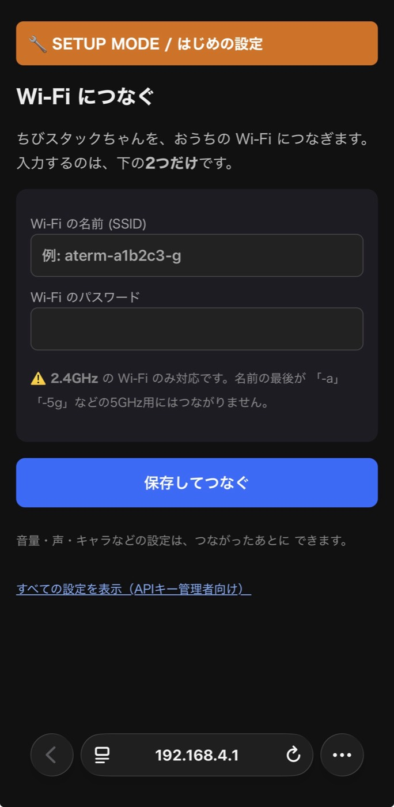

# ちびスタックちゃん (Chibi StackChan)

**ATOMS3R AI Chatbotキット**（AtomS3R + Atomic Echo Base, 8MB PSRAM）で動く、
手のひらサイズのAIスタックちゃん。[guruguru-stackchan](../guruguru-stackchan)（Core2版）からの派生です。

> 📖 **完成品を受け取った方へ**: 設定済みの機体の使い方は
> **[取扱説明書 (MANUAL.md)](MANUAL.md)** をご覧ください。以下は作る人向けの情報です。

- 🧠 **会話**: Google **Gemini**（`gemini-3.5-flash`・無料枠あり）または
  Anthropic **Claude**（`claude-haiku-4-5`・従量課金）— **Web UIで切り替え可**
- 👂 **音声認識(STT)**: OpenAI **Whisper**
- 🗣️ **音声合成(TTS)**: **VoiceVox**（Web API）
- 🙂 **表情**: m5stack-avatar（128×128 に縮小表示・**吹き出しなし**・口パクあり）
- 🔩 **サーボ**: SG90 × 1（Grove接続）。**左右首振りのみ・連続回転なし**。
  会話中は声の大きさに合わせてゆらゆら、待機中はときどきキョロッ
- 📣 **会話スタート**: 3モード切り替え — **呼びかけワード方式** /
  **なんでも返事**（聞き取れた発話すべてに応答）/ 無効（画面タッチのみ）
  ＋ 画面クリックでも即スタート
- ⏲️ **タイマー**: 「スタックちゃん、3分タイマー」で音声セット→時間が来たら喋って知らせる
- 😴 **おやすみ**: 3分間会話が無いと眠る（眠い顔・サーボ停止）。声をかけると
  「寝てしまった！」と飛び起きる（起床ボイスは本体にキャッシュされネット不要で即再生）
- ☀️ **おまけ**: 今日の天気（Open-Meteo・APIキー不要）と現在時刻（NTP）を会話に反映
- 🔌 **電源**: ATOMS3R の USB-C 給電
- 📶 **設定**: 全て NVS 保存。未設定/接続失敗/起動時画面長押しで **AP設定ポータル**
  （iPhoneのブラウザから入力）。**鍵情報クリアボタン**あり

---

## 必要なもの

| 区分 | 内容 |
|---|---|
| 本体 | M5Stack **ATOMS3R**（8MB PSRAM）+ **Atomic Echo Base**（= AI Chatbotキット） |
| サーボ | **SG90** など PWM ポジションサーボ ×1（180度型。連続回転型は不可） |
| 鍵 | Gemini または Claude APIキー（会話）/ OpenAI APIキー（Whisper用）/ VoiceVox APIキー |
| 電源 | USB-C（ATOMS3R 側に接続） |

## 配線（サーボ）

ATOMS3R 本体側面の **Grove ポート（G1 / G2 / 5V / GND）** に接続:

| SG90 | Grove |
|---|---|
| 信号（橙/黄） | **G2** |
| VCC（赤） | 5V |
| GND（茶/黒） | GND |

> 信号ピンを G1 に変えたい場合は `src/HeadServo.h` の `kServoPin` を `1` に。
> 可動範囲・振幅・速さも同ファイル冒頭の定数で調整できます。
> Echo Base は ATOMS3R の底面にそのまま合体（I2S/I2C は M5Unified が自動設定）。

## ビルド & 書き込み（PlatformIO）

```bash
cp include/secrets.h.example include/secrets.h   # （任意）初期値を書く場合
pio run                  # ビルド
pio run -t upload        # 書き込み
pio device monitor       # シリアルモニタ (115200)
```

- Core2 版と違い esp-sr を使わないため **`framework = arduino` 単独**でビルドできます
  （IRAM 問題・espidf ハイブリッド・setuptools 対策は不要）。
- `secrets.h` は **NVS が空のときの初期値**としてのみ使用。無くても
  （中身がプレースホルダのままでも）AP設定ポータルから全部入力できます。
- ⚠️ 書き込みはシリアルモニタを閉じてから。失敗する場合はポート明示
  （`pio run -t upload --upload-port /dev/cu.usbmodemXXXX`）や、本体側面の
  リセットボタン約2秒長押し（緑LED点灯=ダウンロードモード）を試してください。

## 初期設定（AP設定ポータル）

以下のいずれかで設定モード（AP）になります:

1. NVS に SSID が未保存（初回起動）
2. 起動時に Wi-Fi 接続へ 15 秒失敗
3. **起動時に画面（Aボタン）を押したまま** / Wi-Fi 接続試行中に画面長押し
4. 通常運用中に **画面を3秒長押し**

設定モードでは:

1. iPhone で Wi-Fi **`ChibiStackChan-Setup`**（パスワード **`stackchan`**）に接続
2. ブラウザで **http://192.168.4.1** を開く
3. SSID / パスワード / 各APIキー / **呼びかけワード** / 天気の場所 などを入力
   →「保存して再起動」

> ⚠️ ESP32 は **2.4GHz 専用**です（5GHz 非対応）。iPhone側は同じルーターなら5GHzでもOK。
> 💡 **空欄の項目は変更されません**。外出先では Wi-Fi の SSID/パスワードだけ入力すれば、
> APIキー等は引き継いだままその場のネットワークに切り替えられます。
> 🗑️ ページ下部の **「鍵情報クリア」** で Wi-Fi・APIキー等の NVS を全消去して
> 再起動→設定モードに戻ります（secrets.h の初期値へのフォールバックも無効化されます）。

## 使い方

| 操作 | 動作 |
|---|---|
| **「スタックちゃん」と呼びかける** | 録音→呼びかけワードを含めば会話開始。「スタックちゃん、今日の天気は？」のように続けて話すとそのまま質問扱い。呼びかけだけなら「なあに？」と聞き返してくる。**「なんでも返事」モードならワード無しの発話にもそのまま返事** |
| 画面クリック | 呼びかけ無しで即録音→会話 |
| 画面3秒長押し | 設定APモードへ |
| 「今何時？」「今日の天気は？」 | NTP時刻 / Open-Meteo の天気を参考情報として会話AI（Gemini / Claude）が答える |
| **「3分タイマーして」** | タイマーをセット。「タイマーやめて」で中止、「あと何分？」で残り確認。時間が来たら「ピピピッ！3分たったよ！」と喋る |
| 「アイピー教えて」 | 自分のIPアドレスを読み上げる（起動時にも画面に大きく数秒表示） |

### 画面の色 = いまの状態

| 背景色 | 状態 |
|---|---|
| ⚫ 黒 | 待機中（呼びかけ待ち） |
| 🟢 緑 | **録音中**（聞いている） |
| 🔵 紺 | **認識・考え中**（Whisper / 会話AI 処理中） |

緑にならない=声がしきい値に届いていない、緑→紺→黒で無反応=聞き取れたが
呼びかけワード無しで破棄（「呼びかけワードで起動」モード時）、という切り分けができます。
なんでも返事モードでは、**物音や無音は黙って無視**し、通信エラーで本当に聞き取れなかった
ときだけ「ごめん、うまく聞き取れなかったよ」と言います。おまけとして、音声認識が
音を言葉にできた場合（電子レンジの「チーン」→「【電子レンジの音】」等）は
**その物音に反応して喋ります**。

### 呼びかけ方式のしくみと注意

```
音量がしきい値を超える音が続く（0.5秒中0.16秒以上）
  → 🟢 録音開始（直前1秒のプリロール付き = 語頭が欠けない）
     喋り終わり（無音2秒）を検出して自動で録音終了（最大12秒）
  → 🔵 Whisper で文字起こし → 呼びかけワード照合
  → 含まれていれば会話AIへ / 無ければ無言で破棄
```

**呼びかけモード**（`/wifi` で切り替え）:

| モード | 動作 | 向き |
|---|---|---|
| 呼びかけワードで起動 | ワードを含む発話だけに応答 | テレビ・人の会話がある部屋 |
| なんでも返事 | 聞き取れた発話すべてに応答（ワード不要） | 静かな部屋・1対1。語頭が拾えなくても無視されない。誤反応とAPI利用は増える |
| 無効 | 画面タッチのみ | 誤反応を完全に防ぎたい時 |

- 呼びかけワードは Web UI で変更可。**カンマ（または読点）区切りで複数登録**できます。
- 照合は**長音・空白を無視**し、5文字以上のワードは**1文字までの聞き違いを許容**
  （「スタッフちゃん」「スタックちゃーん」でもOK）。**3文字以下の短いワードは
  誤爆しやすいので登録しない**のがおすすめ。
- 一瞬の衝撃音（ノック・食器音）ではトリガしません（継続音のみ）。
- **物音のたびに Whisper API が呼ばれる**ため、うるさい場所では設定画面の
  「音量トリガ感度」を大きく（鈍く）するか、呼びかけ起動を無効（画面クリックのみ）に。
- 無音時の Whisper 幻聴（「ご視聴ありがとうございました」等）は自動で弾きます。
- タイマーの定型句（「◯分タイマー」「◯分はかって」等）は会話AIを介さず
  本体だけで即処理されるため、APIの混雑時でも確実に動きます。

### 感度の調整（シリアルモニタを見ながら）

シリアル (115200) に毎秒 `[VAD] peak=823 (threshold=5000)` と出ます。

1. 静かな状態の peak（環境音）と、話しかけたときの peak をメモ
2. 「環境音 < しきい値 < 声」になるよう `/wifi` の音量トリガ感度を設定（保存で再起動）
3. 声の peak が 32000 付近に張り付く場合は**音割れ**。`/setting?mic=16` などで
   マイク感度を下げると Whisper の認識精度が上がります（即反映・再起動不要）

## 通常運用時の Web UI

Wi-Fi 接続後はポート80でWebサーバが起動。同じWi-FiのiPhoneから
**http://chibi-chan.local/**（mDNS/Bonjour。または起動時に画面表示されるIP）へ。

| URL | 内容 |
|---|---|
| `/` | メニュー（設定・ロール・しゃべらせる・文字で質問） |
| `/wifi` | **設定フォーム**（Wi-Fi / APIキー / **会話AI切り替え** / 呼びかけモード / 感度 / 音量 / 天気の場所 / 鍵クリア）→ 保存で再起動 |
| `/role` | ロール（キャラ設定＝システムプロンプト）。SPIFFS保存。感情タグのルールは自動追記 |
| `/role_get` | 現在のロール確認 |
| `/setting?volume=200&mic=48&speaker=3` | 音量・マイク感度・VoiceVox話者の即時変更（再起動不要） |
| `/speech?say=こんにちは` | しゃべらせる |
| `/chat?text=おはよう` | 文字で質問 |
| `/face?expression=1` | 表情変更（0:Neutral 1:Happy 2:Sleepy 3:Doubt 4:Sad 5:Angry） |

| メニュー (`/`) | 設定フォーム (`/wifi`) |
|---|---|
|  |  |

| ロール設定 (`/role`) | ロール確認 (`/role_get`) |
|---|---|
|  |  |

設定モード（APポータル `192.168.4.1`）は Wi-Fi 入力だけの専用画面になる。
全項目を触りたいときは末尾のリンク（`/wifi?full=1`）から従来のフォームを開く:



### iPhoneのホーム画面に「アプリ化」する

1. Safari で http://chibi-chan.local/ を開く
2. **共有ボタン →「ホーム画面に追加」**
3. 以降はホーム画面のアイコンからワンタップで設定画面へ

> 💡 iPhone が同じルーターの **5GHz に接続していてもOK**（2.4GHz縛りは本体側だけ）。
> つながらない時は、ゲストWi-Fi・「プライバシーセパレータ/AP隔離」がONのSSIDでないか
> 確認を。mDNSが引けない場合は本体起動時に画面表示されるIPを直接入力してください。
> ⚠️ **2台以上を同じWi-Fiで動かすと `chibi-chan.local` が衝突**して、どちらに
> つながるか不定になります。複数台運用時はIP直打ちで（IPは起動時の画面表示か
> 「アイピー教えて」の読み上げで確認できます）。

## 会話AIを Claude にする場合（任意）

Gemini の無料枠が混み合って不通になりがちな場合、会話だけ Claude に切り替えられます。

1. https://platform.claude.com/ にログイン（claude.ai と同じアカウントでOK。**Pro等の
   サブスクとAPIは別料金**）
2. Billing → **Buy credits** でクレジット購入（最低 $5・プリペイド式）。
   **Auto reload は OFF** にしておくと使い切っても勝手に課金されません
3. API Keys → **Create Key** → キーをコピー（一度しか表示されません）
4. 本体の `/wifi` で「Claude API Key」に貼り付け →「会話AI」を **Claude** に → 保存

モデルは `claude-haiku-4-5`（`main.cpp` の `CLAUDE_MODEL` で変更可）。
1会話あたり約0.3円、$5 で2,000回以上会話できます。

## APIの使用量・課金状況を確認する

| サービス | 確認場所 | 見るところ |
|---|---|---|
| Claude (Anthropic) | https://platform.claude.com/ | **Usage**: 日別・モデル別・**APIキー別**のトークン使用量 / **Cost**: 金額換算 / **Settings → Billing**: クレジット残高 |
| OpenAI (Whisper) | https://platform.openai.com/usage | 音声認識の使用量。**録音時間で課金**されるため、会話AIより先にこちらが増えがち |
| Gemini (Google) | https://aistudio.google.com/ | 無料枠の使用状況 |

- **機体ごとに専用のAPIキーを発行する**のがおすすめ。Usage はキー単位でフィルタ
  できるので機体別の使用量が分かり、使いすぎたらそのキーだけ無効化できます。
- コスト目安: 会話1回あたり Claude(haiku)で約0.3円 + Whisper で約0.5円。
  1日100回話しかけても月に数百円程度です。
- Anthropic は **Auto reload を OFF**、OpenAI は **Usage limits** を設定しておくと
  想定外の課金を防げます（プリペイド分を使い切ると止まるだけ）。

## おまけ: 2台で会話させる

2台のちびスタックちゃんを向かい合わせると、勝手に会話を始めます。
喋っている間は自分のマイクがオフになる（スピーカーと同一チップ）ため、
自分の声には反応せず、相手の声にだけ反応する — という構造がそのまま使えます。

1. 両方とも呼びかけモードを「**なんでも返事**」に
2. **30〜50cm** で向かい合わせる（相手の声が音量トリガに届く距離）
3. `/role` でキャラを変える（例: ツッコミ役とボケ役）。
   「**返事は30文字以内で短く**」「**必ず相手に質問し返して**」を入れるのがコツ
   （長台詞は最大録音12秒からはみ出して会話が噛み合わなくなる。質問がないと
   「そうだね」「うんうん」で収束する）
4. VoiceVox話者番号も変える（`/setting?speaker=8` など。声の聞き分け用）
5. 片方の画面をクリックして「こんにちは、自己紹介して」で着火

止めるときはどちらかの画面を3秒長押し（設定モード落ち）か電源断。
1往復で両側のWhisper/会話AI/VoiceVoxを消費する（約1円/往復）ので、
放置しっぱなしにはご注意を。

## 構成

```
chibi-stackchan/
├── platformio.ini            # ATOMS3R (arduino単独・PSRAM有効)
├── docs/images/              # Web UI スクリーンショット
├── include/
│   ├── secrets.h.example     # 鍵テンプレート
│   └── secrets.h             # 実際の鍵（git管理外・無くても可）
└── src/
    ├── main.cpp              # 本体（呼びかけ・タイマー・ポータル・Gemini/Claude・Web UI）
    ├── HeadServo.{h,cpp}     # ★SG90 左右首振り（新規）
    ├── WeatherClock.{h,cpp}  # ★NTP時刻 + Open-Meteo天気（新規）
    ├── Whisper / AudioWhisper        # STT（guruguruから移植・プリロール/自動打ち切り対応）
    ├── WebVoiceVoxTTS / AudioOutputM5Speaker / AudioFileSourceHTTPSStream  # TTS
    └── rootCA*.h             # 証明書（rootCAanthropic.h = Claude API用 GTS Root R4/R1）
```

## メモ / 既知の注意点（ATOMS3R固有のハマりどころ）

- **Atomic Echo Base（ES8311）対応は M5Unified 0.2.x 以降**が必要
  （`cfg.external_speaker.atomic_echo = true`）。本プロジェクトは 0.2.17 でビルド確認済み。
  マイクとスピーカーは同一コーデックのため、録音と再生を `M5.Mic`/`M5.Speaker` の
  begin/end で切り替えています（Core2版と同じ流儀）。
- **`Serial`(HWCDC) の出力がUSBに届かない**ため、アプリのログは `printf`
  （IDFコンソール）を使っています。自作ログを足すときも `printf` で。
- **`M5.Mic.isEnabled()` は動作状態を返しません**（ピン設定の有無だけ）。
  マイクの再始動検知は `isRunning()` を使うこと。
- **ES8311 はマイク再始動直後に約0.4秒のフルスケールノイズ**を出すため、
  VADは起動後0.8秒を捨てています（`vad_triggered()` のウォームアップ）。
- **ESP32-S3 の LEDC(PWM) は最大14ビット**。16ビットを指定すると初期化に失敗して
  サーボが動きません（`HeadServo.cpp` は14ビットに設定済み）。
- 顔の縮小は `avatar.setScale(0.4)` + `setPosition(-56, -96)`。ずれる場合はここを微調整。
- サーボはアイドル時 PWM を止めて脱力（省電力・ジー音防止）。
- NVS 名前空間: Wi-Fi=`wifi`、鍵・呼びかけ・天気=`chibi`、音量等=`setting`。
  guruguru（Core2版）の `guruchan` とは独立。

## ライセンス / クレジット

本プロジェクト自体のコードは **MIT License** です（[LICENSE](LICENSE)）。

このプロジェクトは、以下の素晴らしいオープンソースプロジェクトの上に成り立っています。
原作者の皆さまに心から感謝します。

| プロジェクト | 作者 | ライセンス | 本プロジェクトでの役割 |
|---|---|---|---|
| [Stack-chan](https://github.com/meganetaaan/stack-chan) | ししかわ (Shinya Ishikawa / meganetaaan) さん | Apache-2.0 | スタックちゃんの原作。すべてはここから |
| [M5Stack-Avatar](https://github.com/meganetaaan/m5stack-avatar) | 同上 | MIT | 顔・表情・口パク |
| [AI_StackChan2](https://github.com/robo8080/AI_StackChan2) | robo8080 さん | MIT | AIスタックちゃんの母体（STT/TTS/会話の流れはここから派生） |
| [M5Unified / M5GFX](https://github.com/m5stack/M5Unified) | M5Stack | MIT | ハードウェア制御（画面・マイク・スピーカー） |
| [ESP8266Audio](https://github.com/earlephilhower/ESP8266Audio) | Earle F. Philhower, III さん | **GPL-3.0** | MP3再生。⚠️ このライブラリをリンクしたビルド済みバイナリの配布には GPL-3.0 が適用されます（本リポジトリはソースのみ配布） |

そのほかのサービス:

- 天気: [Open-Meteo](https://open-meteo.com/)（無料・APIキー不要）
- 音声合成: [VOICEVOX](https://voicevox.hiroshiba.jp/)（生成音声の利用は各キャラクターの利用規約に従ってください）
- 音声認識: OpenAI Whisper API / 会話: Google Gemini API・Anthropic Claude API
